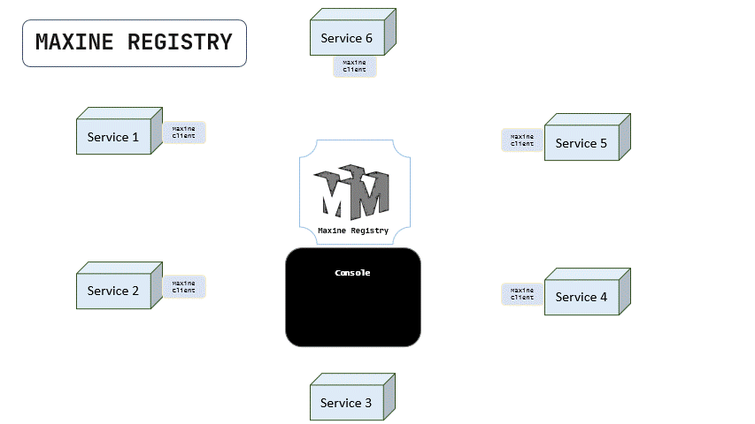
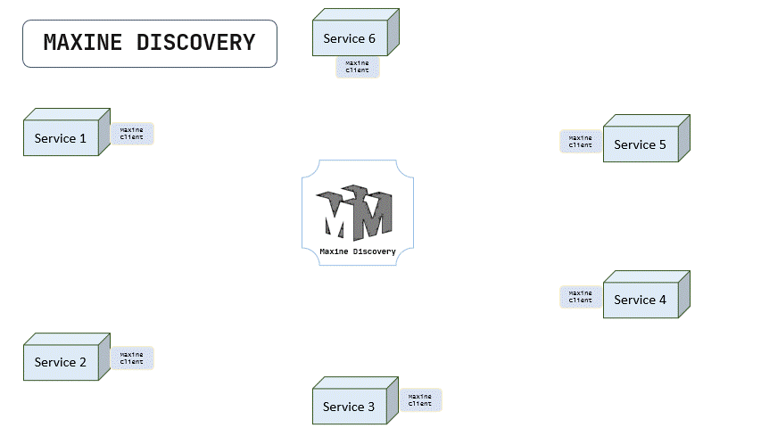

## Maxine : Service Discovery and Registry for Microservices

<a target="_blank" href="https://sonarcloud.io/summary/new_code?id=VrushankPatel_Maxine">

 

 

 

## Introduction

Maxine is a Service registry and discovery server that detects and registers each service and device in the network, providing service addresses for client-side discovery to enable fast communication between microservices. It includes optional reverse proxy capabilities for scenarios requiring centralized routing. Maxine SRD solves the problem of hardwiring URLs to establish flawless communication between microservices.

Maxine SRD has the ability to locate a network automatically making it so that there is no need for a long configuration setup process. The Service discovery works by services connecting through REST on the network allowing devices or services to connect without any manual intervention.

## How Maxine works

1. Assuming that the Maxine SRD server is up and running and all the services or microservices in the network have MAXINE-CLIENT added as a dependency in it, below are the steps on how Service discovery will work.
2. The Maxine client installed in all the services will start sending the heartbeat (A special request that'll have all the necessary metadata of that service to let the other services connect) to the Maxine SRD.
3. The SRD server will extract the service metadata from that request payload and will save it in the in-memory database (to reduce the latency), The server will also run a thread that'll remove that service metadata after the given timeout in the metadata (If not provided, then default heartbeat timeout will be used). SRD will store the data by keeping the serviceName as the primary key so that by the serviceName, its URL can be discovered.
4. After this, all the services that want to intercommunicate with the service inside its network, They'll connect to that service via the Maxine client, using the serviceName instead of the service URL. The Maxine API client will query SRD for the service address.
5. SRD will receive the request and will extract the serviceName from it. It'll discover if that service is stored there in the registry, If it is, then it'll return the service's address to the client for direct connection. Optionally, if proxy mode is enabled (proxy=true), it can proxy the request to the service.
6. If that service name has multiple nodes in the registry, then SRD will select a node based on the load balancing strategy and return its address.

Below is a tiny animation that explains how maxine registers all the services in the network by their HEARTBEATs sent by the maxine client.
  

  
Notice that the service 3 doesn't have maxine-client installed so it is not sending the heartbeat and therefore, it can not be registered in the maxine registry.
However, that's not the end of it, the explicit custom client can be developed (based on the API Documentation) to communicate with maxine server.
Once the services are registered, Below is the animation that shows how services intercommunicate by maxine client and via maxine's service discovery.
  

  
As we can see, maxine SRD provides service addresses for direct client connections, enabling fast and efficient inter-service communication. When proxy mode is used, it acts as a reverse proxy, routing requests to the appropriate servers.

## What problems does Maxine solve?

* When working with SOA (Service oriented architecture) or microservices, we usually have to establish the inter-service communication by their URL that gets constituted by SSL check, Hostname, port, and path.
* The host and port are not something that'll be the same every time. Based on the availability of ports, we have to achieve a flexible architecture so, we can choose the ports randomly but what about the service communication, how'd the other services know that some service's address is changed?
* That's the issue that Maxine solves. No matter where (on which port) the service is running, as long as the MAXINE-CLIENT is added to it, it'll always be discoverable to the SRD. This centralized service store and retrieval architecture make inter-service communication more reliable and robust.
* Also, based on the service's performance diagnostics (If it's down or not working properly), we can stop its registration to the SRD. The client provides functions that can stop sending the heartbeat to the SRD so that the service can be deregistered.
* Also, If any of the services are hosted on more powerful hardware, then we can make SRD distribute more traffic on that service's nodes than the others. All we have to do is to provide weight property to that service's client. the weight means how much power that service has compared to others. Based on weight property, the SRD will register that service will replications, and traffic will be distributed accordingly.
 * Maxine now includes health check capabilities to monitor service availability and persistence to survive restarts.
  * Maxine is optimized for high performance with in-memory LRU caching (1M entries, 1-hour TTL), debounced file saves, parallel health checks (every 60 seconds with 50 concurrency), connection pooling, circuit breaker for unhealthy nodes, and efficient load balancing algorithms including Round Robin, Weighted Round Robin, Least Response Time, Consistent Hashing, Rendezvous Hashing, Least Connections, Least Loaded, and Random. High performance mode disables response time tracking and connection counting for maximum throughput. Health checks disabled by default for maximum performance; enable with HEALTH_CHECK_ENABLED=true for automatic service health monitoring.
 * Security is enhanced with JWT authentication and role-based access control (RBAC) for all registry operations.
* Comprehensive metrics collection provides insights into request counts, latencies, and error rates.
* Clustering support for multi-core CPU utilization.
* Configuration via environment variables for flexible deployment.

## New Features

      * **Performance Optimizations**: In-memory caching for discovery operations with 10-minute TTL for cache freshness, debounced asynchronous file/Redis saves for persistence, parallel health checks with 200 concurrency using native HTTP modules for reduced overhead, aggressive connection pooling for proxying (50000 max sockets with 5min keep-alive), and API rate limiting. Discovery cache now intelligently uses IP-based keys only for strategies that require it (CH/RH), eliminating unnecessary cache misses. Optimized data structures using Maps and Sets for O(1) lookups in healthy nodes and response times tracking. Fixed metrics latency recording to accurately measure full request response times. Consistent Hashing now uses the hashring library for O(1) hash lookups. Healthy nodes array is cached to avoid repeated Array.from() calls. Weighted Round Robin implemented properly using expanded node lists based on weights. LRU cache size optimized to 1M entries for better memory usage under high load. High performance mode enabled by default, disabling logging and metrics for discovery endpoints to improve throughput. Cache statistics include hit/miss ratios for performance monitoring. Lodash dependency removed and replaced with native JavaScript methods for reduced bundle size and faster execution. Compression enabled when high performance mode is disabled for reduced response sizes; disabled in high performance mode for maximum throughput. HTTP/2 support added for improved performance over HTTP/1.1. Optimized string operations in discovery controller to reduce CPU overhead. Load balancing strategies now use per-service offsets to prevent contention and ensure fair distribution. Added invalidateCache methods to all strategies for proper cache invalidation on registry changes. Optimized alias lookups with reverse mapping for O(1) alias resolution. Client-side discovery enabled by default for maximum performance, with optional proxy mode. Added short-term caching (1 second TTL) to Rendezvous Hash, Least Connections, Least Loaded, and Adaptive discovery strategies to avoid scanning all nodes on every request. Optimized healthyNodes management with Sets for O(1) existence checks during add/remove operations.
* **Circuit Breaker**: Automatically skips unhealthy service nodes during discovery with failure counting and automatic recovery to improve reliability.
 * **Background Health Monitoring**: Continuous health checks every 30 seconds to maintain up-to-date service status without impacting request latency. Supports custom health endpoints via service metadata.
* **Optimized Discovery**: Healthy nodes cache eliminates filtering overhead on each discovery request, ensuring lightning-fast service lookups.
 * **Load Balancing Strategies**: Supports Round Robin (RR), Weighted Round Robin (WRR), Least Response Time (LRT), Fastest Node (FASTEST), Consistent Hashing (CH), Rendezvous Hashing (RH), Least Connections (LC) with real connection tracking, Least Loaded (LL), Random selection with health-aware routing, Power of Two Choices (P2), Adaptive load balancing that combines response time and connection metrics, and Sticky Round Robin (STICKY) for client affinity.
* **Security**: JWT-based authentication for registry operations (register, deregister, discover, health, metrics).
 * **Metrics**: Real-time metrics endpoint at `/api/maxine/serviceops/metrics` providing request counts, latencies, and error statistics. Prometheus-compatible metrics at `/api/maxine/serviceops/metrics/prometheus`. Cache statistics at `/api/maxine/serviceops/cache/stats`.
* **Health Checks**: Enhanced parallel health monitoring for service nodes with automatic status updates and persistence across restarts.
* **Service Tagging and Filtering**: Services can be tagged via metadata, and discovery can be filtered by tags using the new `/api/maxine/serviceops/discover/filtered` endpoint.
* **Service Versioning**: Discovery supports version-specific routing via the `version` query parameter, allowing clients to target specific service versions.
* **Non-Proxy Discovery**: Added `/api/maxine/serviceops/discover/info` endpoint to retrieve service node information without proxying, useful for clients that need the address directly.
         * **Service Changes Watch API**: Added `/api/maxine/serviceops/changes` endpoint to poll for real-time registry changes (register, deregister, health status updates) since a given timestamp.
         * **Service Groups Listing**: Added `/api/maxine/serviceops/servers/group` endpoint to list all services and their healthy nodes filtered by group.
        * **Least Loaded Load Balancing**: New LL strategy that routes requests to the service node with the least active connections.
        * **Fastest Node Load Balancing**: New FASTEST strategy that always routes to the node with the lowest average response time.
        * **Cache Statistics**: Added `/api/maxine/serviceops/cache/stats` endpoint to monitor discovery cache performance.
        * **Clustering Support**: Enable multi-worker clustering for better CPU utilization by setting `CLUSTERING_ENABLED=true`.
        * **Environment Configuration**: All configuration options can now be set via environment variables for easier deployment and management.
        * **Service Regions and Zones**: Support for multi-datacenter deployments with region and zone parameters in service registration and discovery.
        * **Service Configuration Management**: Added endpoints for setting, getting, and deleting service-specific configurations at `/api/maxine/serviceops/config/*`.
        * **Webhook Notifications**: Added webhook support for real-time notifications on service registry changes. Register webhooks via `/api/maxine/serviceops/webhooks/add` and receive POST notifications for register, deregister, and health status changes.
        * **Redis Support**: Added Redis integration for distributed registry storage, enabling multiple Maxine instances to share the same registry data for high availability and scalability.
        * **Service Aliases**: Services can now register with multiple aliases, allowing a single service to be discoverable under different names. Use the `/api/maxine/serviceops/aliases/*` endpoints to manage aliases.
        * **Service Maintenance Mode**: Services can be put into maintenance mode to temporarily exclude them from discovery without deregistering. Use the `/api/maxine/serviceops/maintenance` endpoint to set maintenance mode.
 * **Service Instance Draining Mode**: Services can be put into draining mode to gracefully stop accepting new requests while allowing existing connections to complete. Use the `/api/maxine/serviceops/draining` endpoint to set draining mode.
        * **Key-Value Store**: Added key-value store functionality for storing and retrieving arbitrary data. Use the `/api/maxine/serviceops/kv/*` endpoints to set, get, and delete key-value pairs.
        * **Client-side Proxy Mode**: Discovery endpoint supports `proxy=false` query parameter to return service address instead of proxying, allowing clients to handle proxying for better performance and flexibility.
        * **Self-Preservation Mode**: Automatically enters self-preservation mode when more than 85% of services fail health checks, preventing cascade failures by not evicting healthy services.
   * **Service Priority Support**: Services can specify priority in metadata, and load balancing strategies prefer higher priority nodes for better resource allocation. Healthy nodes are sorted by priority descending.
           * **Advanced Health Checks**: Support for TCP health checks in addition to HTTP. Set `healthType: 'tcp'` in service metadata for TCP checks. Custom HTTP methods (GET, POST, etc.) supported via `healthMethod` in metadata.
           * **Audit Logging**: All registry operations (register, deregister) are logged to `logs/audit.log` for compliance and monitoring.
           * **DNS SRV Discovery**: New `/api/maxine/serviceops/discover/dns` endpoint returns DNS SRV-like records for services, useful for DNS-based service discovery.
             * **Traffic Splitting for Versions**: Services can specify `trafficSplit` in metadata to route requests to different versions based on percentages, enabling canary deployments and gradual rollouts.
               * **CLI Tool**: Added a command-line interface at `bin/cli.js` for managing services (register, deregister, list, health, discover, metrics, backup, restore, config).
              * **Client SDK**: Added a JavaScript/Node.js client SDK in `client-sdk/` for easy integration with Maxine registry.
             * **Lightning-Fast Performance Mode**: High performance mode now skips response time recording and active connection tracking for maximum throughput under heavy load.
               * **gRPC Support**: Added gRPC endpoint for service discovery at port 50051 (configurable via GRPC_PORT), enabled with GRPC_ENABLED=true.
               * **Batch Discovery**: Added `/api/maxine/serviceops/discover/batch` endpoint to discover multiple services in a single request, improving performance for clients needing multiple service addresses.
                    * **Envoy Configuration Generation**: Added `/api/maxine/serviceops/envoy/config` endpoint to generate Envoy proxy configuration for all registered services, enabling seamless integration with service mesh architectures.
                    * **WebSocket Support**: Added WebSocket server for real-time notifications of service registry changes (register, deregister, health updates).
                   * **OpenTelemetry Tracing**: Added support for distributed tracing using OpenTelemetry with Jaeger exporter for better observability in microservices architectures. Enable with `TRACING_ENABLED=true` and configure `JAEGER_ENDPOINT`.
                   * **Backup and Restore**: Added `/api/maxine/serviceops/backup` endpoint to export the entire registry state as JSON, and `/api/maxine/serviceops/restore` to import and restore from a backup. Useful for disaster recovery and migration. CLI commands `backup` and `restore` are also available.
                   * **etcd Persistence**: Added etcd support for distributed key-value storage of the registry, providing high availability and consistency. Enable with `ETCD_ENABLED=true` and configure `ETCD_HOST` and `ETCD_PORT`.
                   * **Kafka Event Streaming**: Added Kafka integration for real-time event streaming of registry changes (register, deregister, health updates). Enable with `KAFKA_ENABLED=true` and configure `KAFKA_BROKERS`.
                   * **Service Instance Draining Mode**: Added support for putting service instances into draining mode to gracefully stop accepting new requests while allowing existing connections to complete. Use the `/api/maxine/serviceops/draining` endpoint.
                      * **Performance Optimizations**: Reduced default health check concurrency from 2000 to 50 to prevent overload, increased discovery cache TTL to 1 hour, cached config checks and alias resolutions for faster lookups, enabled HTTP/2 by default for improved performance over HTTP/1.1, optimized IP extraction caching in discovery controller, and precomputed service name building to reduce string operations. Further optimized health check concurrency to 50 and interval to 60 seconds, increased proxy connection pool to 10000 maxSockets for high throughput, added service name caching in discovery controller to avoid repeated string concatenations. Health checks disabled by default for maximum performance; enable with HEALTH_CHECK_ENABLED=true. Added LRU caching for alias resolutions, IP extractions, and service name building to prevent memory leaks and improve performance under high load.
                     * **Push Health Updates**: Added `/api/maxine/serviceops/health/push` endpoint allowing services to push their health status updates directly to the registry, enabling faster health monitoring without relying solely on pull-based checks.
                     * **Service Priority**: Services can now specify priority in metadata for load balancing preference. Healthy nodes are sorted by priority (higher first).
                     * **Per-Service Rate Limiting**: Discovery requests are now rate limited per service per IP to prevent abuse.
                    * **Service Groups**: Added support for service groups to allow hierarchical service organization. Services can be registered with a `group` in metadata, and discovery can filter by `group` query parameter.
                    * **Service Dependency Graph**: Added `/api/maxine/serviceops/dependency/graph` endpoint to retrieve the service dependency graph, showing which services depend on others.
                    * **Impact Analysis**: Added `/api/maxine/serviceops/impact/analysis` endpoint to analyze the impact of a service failure by listing all services that depend on it.
                    * **Python Client SDK**: Added a Python client SDK in `client-sdk/python/` for easy integration with Maxine registry from Python applications.
                * **Service API Specs**: Services can now register their API specifications (e.g., OpenAPI/Swagger) via the `/api/maxine/serviceops/api-spec/set` endpoint, and retrieve them via `/api/maxine/serviceops/api-spec/get`. This enables better service contract management and API documentation.
                 * **Service Tag Filtering**: Discovery requests can now filter services by tags using the `tags` query parameter. Services must have all specified tags in their metadata to be discoverable.
                 * **Service Metadata Updates**: Added `/api/maxine/serviceops/metadata/update` endpoint to update service instance metadata without re-registration, allowing dynamic changes to weights, health endpoints, and other properties.

## Setup for development

### Starting the development server

1. Clone the project in your local dir.
2. Install all the dependencies by `npm i`.
3. (Optional) Configure via environment variables (see Configuration section).
4. Start dev server by `npm run dev` (nodemon).

### Test the maxine and generate the coverage.

1. run `npm test` to run all the tests.
2. To generate the reports, there is a task called genreports, try `npm run genreports` to generate reports.
3. To upload the coverage report to codecov.io, the codecov token is required, set the parameter `>>> CODECOV_TOKEN = {token}` in environment and run `npm run coverage` to upload the coverage to codecov.

### Configuration

Maxine can be configured via environment variables:

  - `CLUSTERING_ENABLED`: Enable clustering (default: true)
  - `NUM_WORKERS`: Number of worker processes (default: CPU cores)
  - `LOG_ASYNC`: Enable async logging (default: true)
  - `HEARTBEAT_TIMEOUT`: Heartbeat timeout in seconds (default: 5)
  - `LOG_JSON_PRETTIFY`: Prettify JSON logs (default: false)
  - `ACTUATOR_ENABLED`: Enable actuator endpoints (default: true)
  - `STATUS_MONITOR_ENABLED`: Enable status monitor (default: false)
    - `HEALTH_CHECK_ENABLED`: Enable health checks (default: false, set to true to enable)
   - `SERVER_SELECTION_STRATEGY`: Load balancing strategy (RR, WRR, LRT, CH, RH, LC, LL, RANDOM, P2, ADAPTIVE, STICKY) (default: RR)
 - `LOG_FORMAT`: Log format (JSON or PLAIN) (default: JSON)
   - `DISCOVERY_CACHE_TTL`: Discovery cache TTL in ms (default: 3600000)
  - `FAILURE_THRESHOLD`: Health check failure threshold (default: 3)
  - `REDIS_ENABLED`: Enable Redis for distributed registry (default: false)
  - `REDIS_HOST`: Redis host (default: localhost)
  - `REDIS_PORT`: Redis port (default: 6379)
  - `REDIS_PASSWORD`: Redis password (default: null)
  - `METRICS_ENABLED`: Enable metrics collection (default: false)
  - `HIGH_PERFORMANCE_MODE`: Disable logging for discovery endpoints to improve performance (default: true). In high performance mode, persistence is disabled by default for maximum speed.
  - `RATE_LIMIT_MAX`: Maximum requests per IP per window (default: 10000)
  - `RATE_LIMIT_WINDOW_MS`: Rate limit window in milliseconds (default: 900000)
   - `HEALTH_CHECK_INTERVAL`: Health check interval in milliseconds (default: 60000)
         - `HEALTH_CHECK_CONCURRENCY`: Maximum concurrent health checks (default: 50)
  - `DEFAULT_PROXY_MODE`: Default proxy mode for discovery (default: false)
    - `GRPC_ENABLED`: Enable gRPC discovery service (default: false, set to true to enable)
   - `GRPC_PORT`: gRPC server port (default: 50051)
     - `TRACING_ENABLED`: Enable OpenTelemetry tracing (default: false, set to true to enable)
    - `JAEGER_ENDPOINT`: Jaeger exporter endpoint (default: http://localhost:14268/api/traces)
      - `HTTP2_ENABLED`: Enable HTTP/2 support (default: true)
    - `ETCD_ENABLED`: Enable etcd for distributed persistence (default: false)
    - `ETCD_HOST`: etcd host (default: localhost)
    - `ETCD_PORT`: etcd port (default: 2379)
    - `KAFKA_ENABLED`: Enable Kafka for event streaming (default: false)
    - `KAFKA_BROKERS`: Kafka brokers (default: localhost:9092)
      - `CIRCUIT_BREAKER_ENABLED`: Enable circuit breaker (default: true, set to false to disable)
   - `PERSISTENCE_ENABLED`: Enable persistence to file/Redis/etcd (default: true, set to false for in-memory only mode)

### Run maxine on production.

1. Run command `npm start` to start the application with all the pretests.

Licence
-------
MIT License Copyright (c) 2022 Vrushank Patel

Permission is hereby granted, free
of charge, to any person obtaining a copy of this software and associated
documentation files (the "Software"), to deal in the Software without
restriction, including without limitation the rights to use, copy, modify, merge,
publish, distribute, sublicense, and/or sell copies of the Software, and to
permit persons to whom the Software is furnished to do so, subject to the
following conditions:

The above copyright notice and this permission notice
(including the next paragraph) shall be included in all copies or substantial
portions of the Software.

THE SOFTWARE IS PROVIDED "AS IS", WITHOUT WARRANTY OF
ANY KIND, EXPRESS OR IMPLIED, INCLUDING BUT NOT LIMITED TO THE WARRANTIES OF
MERCHANTABILITY, FITNESS FOR A PARTICULAR PURPOSE AND NONINFRINGEMENT. IN NO
EVENT SHALL THE AUTHORS OR COPYRIGHT HOLDERS BE LIABLE FOR ANY CLAIM, DAMAGES OR
OTHER LIABILITY, WHETHER IN AN ACTION OF CONTRACT, TORT OR OTHERWISE, ARISING
FROM, OUT OF OR IN CONNECTION WITH THE SOFTWARE OR THE USE OR OTHER DEALINGS IN
THE SOFTWARE.

### Licence scan

