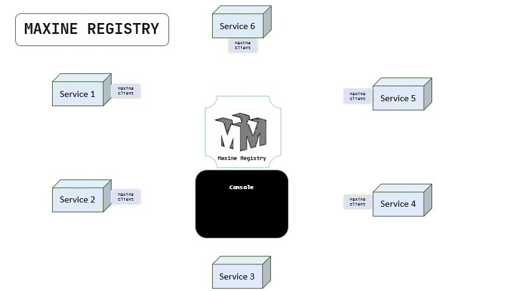
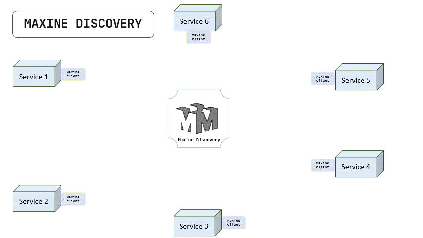

 

## Introduction

Maxine is a Service registry and a discovery server that detects and registers each service and device in the network and works as a reverse proxy to make each service available by its name. Maxine SRD solves the problem of hardwiring URLs to establish flawless communication between microservices.

Maxine SRD has the ability to locate a network automatically making it so that there is no need for a long configuration setup process. The Service discovery works by services connecting through REST on the network allowing devices or services to connect without any manual intervention.

The current implementation plan and known gaps are tracked in [roadmap.md](roadmap.md).
Official SDKs currently live in-repo for Node.js, Java, Python, and Go.
Maxine also now includes a Helm chart for namespace-scoped Kubernetes installs plus a Redis-backed shared state mode for multi-replica deployments.

## How Maxine works

1. Assuming that the Maxine SRD server is up and running and all the services or microservices in the network have MAXINE-CLIENT added as a dependency in it, below is the explaination of how Maxine SRD works.
2. The Maxine client installed in all the services will start sending the heartbeat (A special request that'll have all the necessary metadata of that service to let the other services connect) to the Maxine SRD.
3. The SRD server will extract the service metadata from that request payload and will save it in the in-memory registry (to reduce the latency). It can also snapshot that registry to local disk or to Redis so active nodes can be restored after a restart or shared across replicas. The server will run a timeout task or shared-state pruning cycle that'll remove that service metadata after the given timeout in the metadata (If not provided, then default heartbeat timeout will be used). SRD will store the data by keeping the serviceName as the primary key so that by the serviceName, its URL can be discovered.
4. After this, all the services that want to intercommunicate inside its network, They'll connect to that service via the Maxine client, and here, it'll use the serviceName instead of the service URL, and the Maxine API client will pass that request to SRD.
5. SRD will receive the request and will extract the serviceName from it. It'll discover if that service is stored there in the registry, If it is, then it'll redirect the request to that service's URL.
6. If that service name has multiple nodes in the registry, then SRD will distribute the traffic across all the nodes of that service by maxine's inbuilt load balancer.

Below is a tiny animation that explains how maxine registers all the services in the network by their HEARTBEATs sent by the maxine client.
  

  
Notice that the service 3 doesn't have maxine-client installed so it is not sending the heartbeat and therefore, it is not being registered in the maxine registry.
However, that's not the end of it, the explicit custom client can be developed (based on the API Documentation) to communicate with maxine server.

Once the services are registered, Below is the animation that shows how services intercommunicate by maxine client and via maxine's service discovery.
  

  
As we can see, maxine SRD is working as a reverse proxy for each servers, and redirecting all the requests to the respective servers by searching for their URLS in registery by using the serviceName as a key.
## What problems does Maxine solve?

* When working with SOA (Service oriented architecture) or microservices, we usually have to establish the inter-service communication by their URL that gets constituted by SSL check, Hostname, port, and path.
* The host and port are not something that'll be the same every time. Based on the availability of ports, we have to achieve a flexible architecture so, we can choose the ports randomly but what about the service communication, how'd the other services know that some service's address is changed?
* That's the issue that Maxine solves. No matter where (on which port) the service is running, as long as the MAXINE-CLIENT is added to it, it'll always be discoverable to the SRD. This centralized service store and retrieval architecture make inter-service communication more reliable and robust.
* The Java SDK now includes a Spring Boot starter that can read `application.properties` and start sending heartbeats automatically once the app is ready.
* Also, based on the service's performance diagnostics (If it's down or not working properly), we can stop its registration to the SRD. The client provides functions that can stop sending the heartbeat to the SRD so that the service can be deregistered.
* Also, If any of the services are hosted on more powerful hardware, then we can make SRD distribute more traffic on that service's nodes than the others. All we have to do is to provide weight property to that service's client. the weight means how much power that service has compared to others. Based on weight property, the SRD will register that service will replications, and traffic will be distributed accordingly.

## Limitations

Maxine SRD can now recover registry state from a local file and can share that state through Redis, but it still has no internal consensus, leader election, or split-brain protection.
SRD can now be replicated with a shared Redis backend, but the application is still logically a single control plane and needs more hardening before it should be treated as a production-grade distributed registry.
